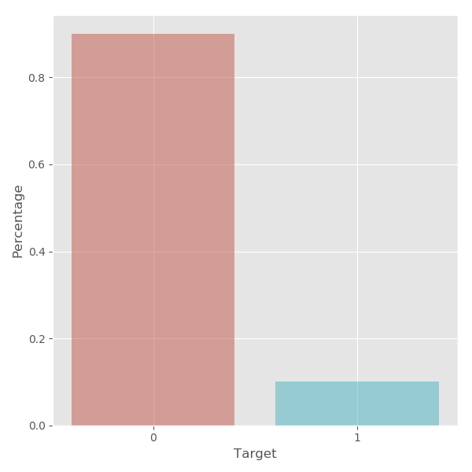

## Santander customer transaction

* Useful Kernel

  > 1. [200 Magical Models - Santander - [0.920]](<https://www.kaggle.com/cdeotte/200-magical-models-santander-0-920/notebook#Let's-Begin>)
  > 2. [List of Fake Samples and Public/Private LB split](<https://www.kaggle.com/yag320/list-of-fake-samples-and-public-private-lb-split>)
  > 3.  [Kaggle之路，与强者为伍——记Santander交易预测](https://www.cnblogs.com/fugeny/p/10702812.html)
  > 4. [2nd place solution](<https://www.kaggle.com/c/santander-customer-transaction-prediction/discussion/88939>)

### EDA

* 

   

  数据整体分布展示，图中展示了 $200$ 个变量的分布, 红色线为 `target 1` 时的分布, 蓝色为 `target 0` 的分布. 详细图见文件 `data_eda.pdf`, 另外, 数据的均值, 标准差, 极值和分位值见文件`data_description.csv` 文件.

* 响应变量在训练数据集的分布:

  

  训练数据集中响应变量的分布, 大约 $\mathrm{Target 1} : \mathrm{Target 0} = 1 :9$. 数据集分布不平衡.

* 数据的相关性探索

   

这里, 我计算了 $\mathrm{target} -\mathrm{variables}$ 之间的相关系数, 可以发现, 相关性并不显著, 另外, 变量之间的分布见右图, 同样的 相关性也非常不明显. 这意味着变量之间比较独立.

同样的, 我们可以进一步进行 PCA.


这是 scree plot, 可以发现下降迅速, 在三个维度后曲线变化趋于平缓,  $5$ 个维度时几乎对变量的解释比例仅为 $0.164$.


这是两个维度下的散点图, 可以发现几乎无法分开.

* 总结: 数据维度很高, 而且变量之间的相关性很低, 数据难以降维. 因此,我们在后续的建模中可以假设变量之间都是独立的.

### 一个粗暴的模型: Modified Naive Bayes

$$
\newcommand{\pra}[1]{\operatorname{P}({#1})}
\pra{T|D}= \frac{\pra{D|T} \cdot \pra{T}}{\pra{D}}\\
$$

$D = \{ v_1, v_2, \cdots, v_{200}\}$ 为输入的数据, 为$T = \{0, 1\}$响应变量, 假设变量之间独立:
$$
\pra{T = 1| v_1, v_2, \cdots, v_n}= \frac{\prod_{k=1}^{200}\pra{v_k|T = 1} \cdot \pra{T = 1}}{\prod_{k=1}^{200}\pra{ v_n}}\\
$$
对于变量 $v_n$ , 我们可以知道:
$$
\pra{T = 1| v_n}= \frac{\pra{v_n|T = 1} \cdot \pra{T = 1}}{\pra{ v_n}}\\
$$
由变量独立, 
$$
\prod_{k=1}^{200}\frac{\pra{T = k| v_k}}{\pra{T =1}} = \frac{\prod_{k=1}^{200}\pra{v_k|T = 1} }{\prod_{k=1}^{200}\pra{ v_n}}
$$
通过统计, 我们由先验: $\pra{T=1} \approx 1/10$, 如果我们对变量的分布进行标准化, 并进行平滑处理, 取合适的bin, 我们可以直接通过对每个变量进行统计, 得出$\pra{T=1| v_k}$.
$$
\pra{T=1| v_k} \approx \frac{\#\{v_k \in [a_j, a_{j+1}), T =1\}}{\#\{v_k \in [a_j, a_{j+1}), T =1\}+\#\{v_k \in [a_j, a_{j+1}), T =0\}}
$$
再将测试数据集代用先验数据集得到的数据分布中就可以直接计算出每个观测的$\pra{T=1| D}$ 的概率, 这个值可以直接提交.

用这样非常粗暴的方法, 我们可以得到的效果却非常出乎意料, LB: 0.899. 也就是说 AUC=0.89003. 代码见文件 `modified_naive_bayes.py`.


相较之下, 我们直接采用 Logistics Regression 得到的结果却并不理想, AUC=0.860, 代码见文件 `logistic.py`:


### LGBM 

在数据的探索和看网页中大家的讨论我们注意到: 1. 数据中存在大量的重复数据, 具体讲, 针对某个变量, 我们可以发现其中有很多数据时完全相同的, 由于公司没有提供给参赛者每个变量的具体含义, 大家的看法也不一致, 有人认为是因为公司数据中存在大量的缺失, 公司直接用其他值去填补. 而且这些值的数量的计数与响应变量存在关系. 也就是说两个相近的数据值, 如果他们计数值差距很大, 它们对于响应变量之间的相关性是不同的.2. 测试数据中存在假数据, 有人发现, 训练集中, 虽然变量存在大量的重复值, 但是每个观测 (数据的行) 都至少拥有一个唯一的唯一的变量 (这个变量的值, 在该列是独一无二的, i.e., 计数值为1), 但是在测试数据集中有一半的观测 (100000) 没有唯一变量, 这就暗示它们是由其他行的数据拼凑而来的. 有人认为这是公司故意给出的, 不参与AUC的计算, 防止参赛者大量提交结果去 "拟合" 测试数据集, 从而作弊.

基于这两点, 我们可以给每个变量再增加一个变量, 即原变量的计数值, 将原先的变量数量扩展到 400 个, 由于每个变量的计数值和该变量相互作用, 我们首先考虑找出他们之间的联系, 使用梯度提升树, 我们可以对每个变量和它们的计数值进行训练 (这样会得到 200 个模型) , 训练过程中我们采用了 4倍的交叉验证 ($4\mathrm{-fold}$ CV). 由于变量之间的独立性较好, 我们采用 Naive Bayes 将这 200 个模型进行集成:
$$
\pra{T = 1| v_1, v_2, \cdots, v_n}= \frac{\prod_{k=1}^{200}\pra{v_k|T = 1} \cdot \pra{T = 1}}{\prod_{k=1}^{200}\pra{ v_n}}\\
$$

$$
\begin{split}
\mathrm{odds} &=\frac{\pra{T = 1| v_1, v_2, \cdots, v_n}}{\pra{T = 0| v_1, v_2, \cdots, v_n}} \\
&= \frac{\prod_{k=1}^{200}\pra{v_k|T = 1} \cdot \pra{T = 1}}{\prod_{k=1}^{200}\pra{v_k|T = 0} \cdot \pra{T = 0}}
\end{split}
$$

我们根据统计可以得到先验:
$$
\Gamma=\frac{\pra{T = 1}}{\pra{T = 0}} = \frac{1}{9}
$$
再用Bayesian 公式
$$
\pra{T|v_k}= \frac{\pra{v_k|T} \cdot \pra{T}}{\pra{v_k}}\\
odds = \Gamma \cdot\prod_{k=1}^{200} \frac{ \pra{T = 1|v_k}}{ \pra{T = 0|v_k} \cdot \Gamma}
$$
其中, $\pra{T = 1|v_k}$ 是模型 $k$ 对变量值 $v_k$ 的训练结果, $\pra{T = 0|v_k} = 1- \pra{T = 1|v_k}$. 为了防止在计算过程中数值发生溢出, 可以采用取对数进行计算. 代码详见文件`003_lgm_200.py`

```flow
st=>start: 将测试数据中的
op1=>operation: 识别测试数据集中的合成行并除去,
将剩余的数据与测试数据集进行合并.
op2=>operation: 分别计算合并后的数据集中出每个变
量的值出现的次数, 将其映射到新的变
量`var_k_count`上.
op3=>operation: 再将测试数据集和训练数据集拆开, 
使用训练数据集对 200 对变量 (原变
量与新变量) 用4倍交叉验证分别进行
训练, 得到 200个模型.
cond=>condition: 新的模型的AUC
是否大于0.5
op4=>operation: Naive Bayes 方法分别对满足条件
的模型进行集成并输出结果.
e=>operation: 丢弃该模型.


op1->op2->op3->cond
cond(yes)->op4
cond(no)->e
```

对于集成方法, 我尝试过根据训练数据集的out of fold 的AUC进行加权的集成方法和Logistics Regression集成方法, 最佳的结果还是由 Naive Bayes 方法得出的. 具体集成的代码见文件 `lgm_logistic.py`.


